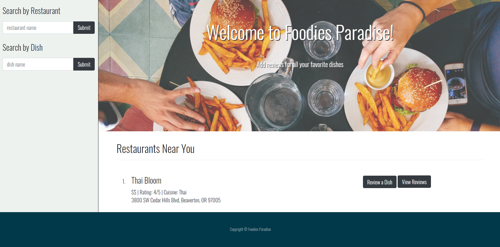
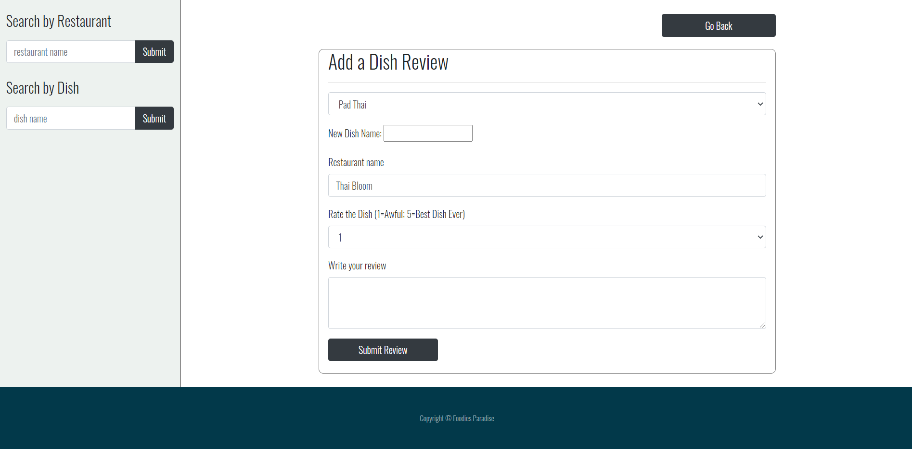

# Foodies Paradise

## Description 
This application utilizes Node, Express, Sequelize, MySQL, & Handlebars templates to create a dish review application. By default, 10 restaurants near the user's location will populate with some information, and options to either view previous dish reviews or add a new dish review. This application is deployed using Heroku.

- Deployed Application: https://frozen-river-52540.herokuapp.com/ 

- Github Repository: https://github.com/AndyMMunro/FoodiesParadise.io 

## Table of Contents
- [Description](#Description)
- [Installation](#Installation)
- [Usage](#Usage)
- [Technologies](#Technologies)
- [Example](#Example)
- [License](#License)
- [Contribution](#Contribution)

## Installation
To install this application, run:

`npm install` 
    
## Usage
This application is for food lovers who are looking for their next restaurant!

## Technologies
- Node.js
- Express.js
- Sequelize
- MySQL
- Handlebars
- Bootstrap
- jQuery 

## Example

    
## License
This application is covered under MIT.
    
## Contributing
Mia de Haan, Mason Curtis, Suganya Somu & Andy Munro
    

